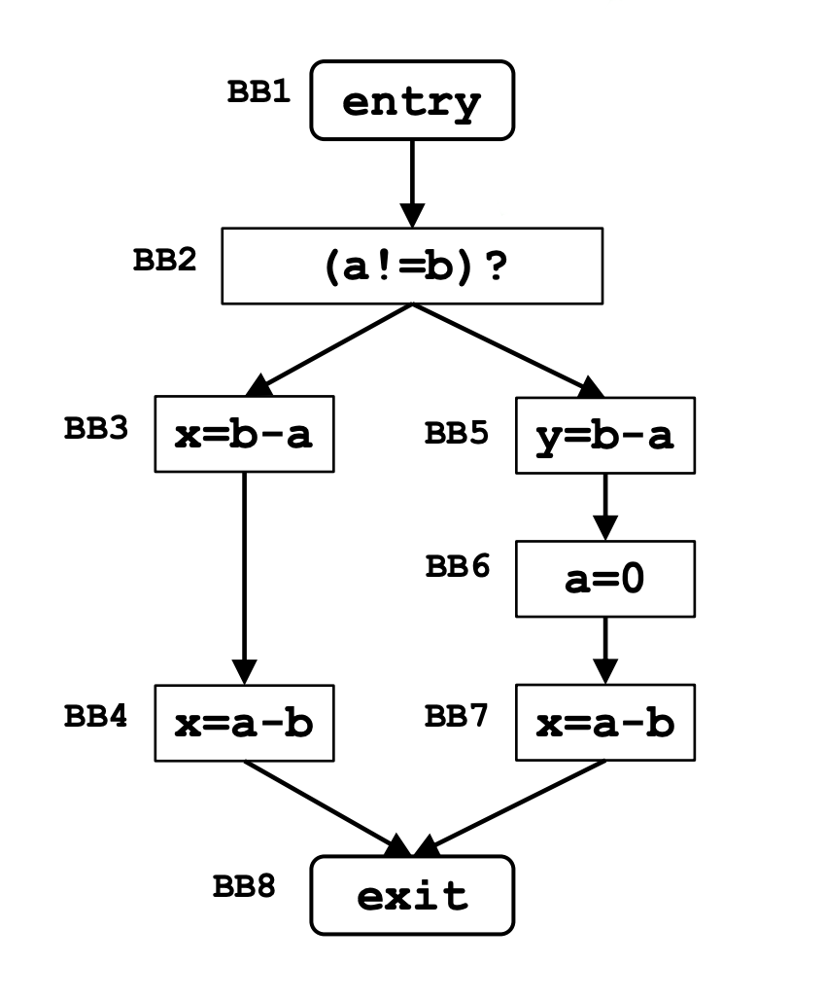
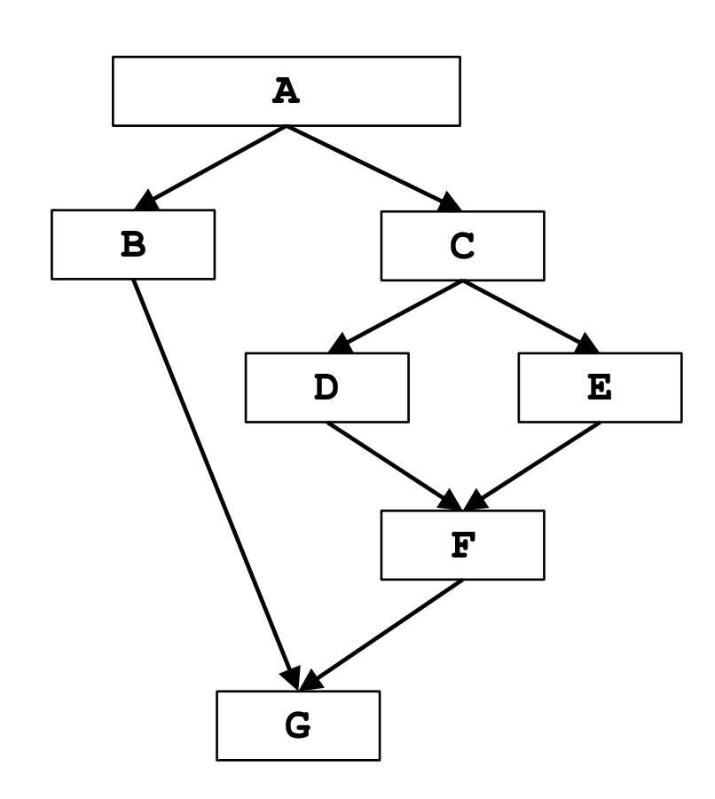

> ⚠️ **Nota importante:**  
> Questo file `README.md` contiene **formule matematiche in LaTeX** e **tabelle complesse** che **GitHub non renderizza correttamente**.  
> In particolare:
> - Le formule scritte in LaTeX (`$$...$$`) **non vengono visualizzate** su GitHub.
> - Le **tabelle con LaTeX incorporato** potrebbero risultare **disallineate o deformate**, soprattutto se contengono espressioni complesse.
>
>**Soluzione consigliata:**  
> - Aprire questo file in un editor con supporto LaTeX e Markdown come **Visual Studio Code**

# Assignment 2:

In questo compito teorico, analizziamo **tre problemi di DataFlow Analysis**, ciascuno con il proprio **Control Flow Graph**. Per ognuno, dobbiamo:  

- Formalizzare il **DataFlow Analysis Framework**.  
- Creare una tabella che mostri le iterazioni dell'algoritmo iterativo per la risoluzione del problema.  

## Very Busy Expression:

Un’espressione è **very busy** in un punto `p` se, indipendentemente dal percorso seguito, viene usata prima che uno dei suoi operandi venga ridefinito.  

- Un'espressione `a + b` è **very busy** in `p` se è valutata in tutti i percorsi da `p` a **EXIT** senza ridefinizioni di `a` o `b`.  
- L’insieme delle espressioni **available** all’inizio di un blocco `B` dipende dai percorsi che partono da `p` prima di `B`.  

### Framework:
|   | **Very Busy Expression**  | 
|:---------|:-------:|
| **Domain**   | Sets of Expressions | 
| **Direction**  | Backward   $in[b] = f_b (\mathrm{out}[b])$  $out[b] = $ ∧ $ in[succ(b)]$|
| **Transfer Function**  | $$f_b(x) = Gen_b \cup (x - Kill_b)$$|
| **Meet Operation ( ∧ )**  | $$\cap$$|
| **Buondary Condition**  | $$in[exit] = \emptyset$$|
| **Initial Interior Point**  | $in[b] = U$|
|||
### Iterations Table:

Determinare i valori di **GEN** e **KILL**, che saranno utilizzati nella **Iteration Table** per l'analisi del flusso di dati.  

| BB  | GEN    | KILL   | EXPR        |
|:---:|:------:|:------:|:------------|
| BB1 | $$\emptyset$$ | $$\emptyset$$ | ENTRY       |
| BB2 | $$\emptyset$$ | $$\emptyset$$ | if          |
| BB3 | b - a  | $$\emptyset$$ | x = b - a  |
| BB4 | a - b  | b - a  | x = a - b  |
| BB5 | b - a  | $$\emptyset$$ | y = b - a  |
| BB6 | $$\emptyset$$ | a - b | a = 0      |
| BB7 | a - b  | $$\emptyset$$ | x = a - b  |
| BB8 | $$\emptyset$$ | $$\emptyset$$ | EXIT       |

<strong>Formula:</strong> 
<code>OUT[BB] = GEN[BB] ∪ (IN[BB] − KILL[BB])</code>

|Blocco|IN 0|OUT 0|IN 1|OUT 1|
|:-------:|:-----------------:|:----------------:|:------------------------------:|:--------------:|
|EXIT|$$\emptyset$$||$$\emptyset$$|$$\emptyset$$|
|BB4|U||$$\{a-b\} \cup \{\emptyset - \{b-a\}\} = \{a-b\}$$|$$IN[EXIT] =\emptyset$$|
|BB3|U||$$\{b-a\} \cup \{\{a-b\} - \emptyset\} = \{a-b, b-a\}$$|$$IN[BB4] = \{a-b\}$$|
|BB7|U||$$\{a-b\} \cup \{\emptyset - \emptyset\} = \{a-b\}$$ | $$IN[EXIT] = \emptyset$$|
|BB6|U||$$\emptyset \cup \{\{a-b\} - \{a-b\}\} = \emptyset$$ | $$IN[BB7] = \{a-b\}$$|
|BB5|U||$$\{b-a\} \cup \{\emptyset - \emptyset\} = \{b-a\}$$|$$IN[BB6] = \emptyset$$|
|BB2|U||$$\emptyset \cup \{\{b-a\} - \emptyset\} = \{b-a\}$$|$$IN[BB3] \cap IN[BB5] = \{a-b, b-a\} \cap \{b-a\} = \{b-a\}$$|

---

## Dominator Analisys:

In un **Control Flow Graph (CFG)**, un nodo `X` **domina** un nodo `Y` se `X` appare in ogni percorso dal blocco **ENTRY** a `Y`.  

### Proprietà dei dominatori
- Ogni **basic block** `Bᵢ` è annotato con un insieme `DOM[Bᵢ]`.  
- `Bᵢ ∈ DOM[Bⱼ]` se e solo se `Bᵢ` domina `Bⱼ`.  
- Per definizione, un nodo **domina sé stesso**: `Bᵢ ∈ DOM[Bᵢ]`.  

### Framework:

|   | **Dominator Analysis**  | 
|:---------|:-------:|
| **Domain**   | Sets of Basic Blocks | 
| **Direction**  | Forward   $out[b] = f_b (\mathrm{in}[b])$  $in[b] = $ ∧ $ out[pred(b)]$|
| **Transfer Function**  | $$f_b(x) = GEN_b \cup x$$|
| **Meet Operation ( ∧ )**  | $$\cap$$|
| **Buondary Condition**  | $$out[entry] = \emptyset$$|
| **Initial Interior Point**  | $$out[b] = U$$|
||

### Iterations Table:
|Blocco|IN 0|OUT 0|IN 1|OUT 1|
|:--------:|:--------:|:--------:|:--------:|:--------:|
|ENTRY||$$\emptyset$$|$$\emptyset$$|$$\emptyset$$|
|A||U|$$\emptyset$$|$$A \cup \emptyset = A$$| 
|B||U|$$OUT[A] = A$$|$$B \cup A = \{A, B\}$$|
|C||U|$$OUT[A] = A$$|$$C \cup A = \{A, C\}$$|
|D||U|$$OUT[C] = \{A, C\}$$|$$D \cup \{A, C\} = \{A, C, D\}$$|
|E||U|$$OUT[C] = \{A, C\}$$|$$E \cup \{A, C\} = \{A, C, E\}$$|
|F||U|$$OUT[D] \cap OUT[E] = \{A, C, D\} \cap \{A, C, E\} = \{A, C\}$$|$$F \cup \{A, C\} = \{A, C, F\}$$|
|G||U|$$OUT[B] \cap OUT[F] = \{A, B\} \cap \{A, C, F\} = A$$|$$G \cup A = \{A, G\}$$|
||||||

Dalla **Iteration Table**, possiamo osservare che: `DOM[F] = { A, C, F }`  

## Constant propagation

Una variabile ha un valore costante in un punto del programma se assume sempre lo stesso valore ogni volta che quel punto viene raggiunto.

- L’obiettivo della constant propagation è identificare dove nel programma una variabile assume un valore **costante**.

- L’informazione associata a ciascun nodo n del control flow graph (CFG) è un insieme di coppie del tipo `<variabile, costante>`.

- La presenza della coppia `<x, c>` in un nodo n garantisce che la variabile x ha sempre valore c ogni volta che n viene eseguito.

### Framework

|                             |  **Constant Propagation**                 |
|:-----------------------------|:-------------------------------------------:|
| **Domain**                  | Sets of (⟨*variable*, *const-value*⟩)      |
| **Direction**               | Forward: $$out[b] = f_b(in[b])$$ $$in[b] = ∧ out[pred(b)]$$|
| **Transfer Function**       | $$f_b(x) = Gen_b \cup (x − Kill_b)  $$    |
| **Meet Operation (∧)**      | $\cap$                                    |
| **Boundary Condition**      | $$out[entry] = \emptyset$$                |
| **Initial Interior Points** | $$out[b] = U$$                         |

### Iterations table
Determinare i valori di **GEN** e **KILL**, che saranno utilizzati nella **Iteration Table** per l'analisi del flusso di dati.  

| BB   | GEN       | KILL   | EXPR       |
|------|-----------|--------|------------|
| BB1  | $$\emptyset$$         | $$\emptyset$$      | ENTRY      |
| BB2  | (k, 2)     | $$\emptyset$$      | k = 2        |
| BB3  |$$\emptyset$$         | $$\emptyset$$      | if         |
| BB4  | (a, 4)     | $$\emptyset$$      | a = k + 2      |
| BB5  | (x, 5)     | $$\emptyset$$      | x = 5        |
| BB6  | (a, 4)     | $$\emptyset$$      | a = k * 2      |
| BB7  | (x, 8)     | $$\emptyset$$      | x = 8        |
| BB8  | (k, 4)     | (k, 2)  | k = a        |
| BB9  | $$\emptyset$$         | $$\emptyset$$      | while      |
| BB10 | (b, 2)     | (b, *)  | b = 2        |
| BB11 | (x, a + k)   | (x, *)  | x = a + k      |
| BB12 | (y, a * b)   | (y, *)  | y = a * b      |
| BB13 | (k, k + 1)   | (k, *)  | k++        |
| BB14 | $$\emptyset$$         | $$\emptyset$$      | print(a + x) |
| BB15 | $$\emptyset$$         | $$\emptyset$$      | EXIT       |
||||

| Blocco | IN 0 | OUT 0 | IN 1 | OUT 1 | IN 2 | OUT 2 | IN 3 | OUT 3 |
|:--------|:------|:--------|:------:|:--------:|:------:|:--------:|:------:|:--------:|
| ENTRY  ||$$\emptyset$$|$$\emptyset$$|$$\emptyset$$|||||
| BB2    ||$$\cup$$|$$\emptyset$$|$$\{(k,2)\} \cup \{\emptyset - \emptyset\} = \{(k,2)\}$$|||||
| BB3    ||$$\cup$$|$$OUT[BB2] = \{(k,2)\}$$ | $$\emptyset \cup \{\{(k,2)\} - \emptyset\} = \{(k,2)\}$$|||||
| BB4    ||$$\cup$$|$$OUT[BB3] = \{(k,2)\}$$|$$\{(a,4)\} \cup \{\{(k,2)\} - \emptyset\} = \{(a,4), (k,2)\}$$|||||
| BB5    ||$$\cup$$|$$OUT[BB4] = \{(a,4), (k,2)\}$$|$$\{(x,5)\} \cup \{\{(a,4), (k,2)\} - \emptyset\} = \{(x,5), (a,4), (k,2)\}$$|||||
| BB6    ||$$\cup$$|$$OUT[BB3] = \{(k,2)\}$$|$$\{(a,4)\} \cup \{\{(k,2)\} -\emptyset\} = \{(a,4), (k,2)\}$$|||||
| BB7    ||$$\cup$$|$$OUT[BB6] = \{(a,4), (k,2)\}$$|$$\{(x,8)\} \cup \{\{(a,4), (k,2)\} - \emptyset\} = \{(x,8), (a,4), (k,2)\}$$|||||
| BB8    ||$$\cup$$|$$OUT[BB5] \cap OUT[BB7] = \{(a,4), (k,2)\}$$|$$\{(k,4)\} \cup \{\{(a,4), (k,2)\} - \{(k,2)\}\} = \{(k,4), (a,4)\}$$|||||
| BB9    ||$$\cup$$|$$OUT[BB8] = \{(k,4), (a,4)\}$$|$$\emptyset \cup \{\{(k,4), (a,4)\} - \emptyset\} = \{(k,4), (a,4)\}$$|$$OUT[BB8] ∩ OUT[BB13] = \{(a,4)\}$$|$$\emptyset \cup \{\{(a,4)\} - \emptyset\} = \{(a,4)\}$$|$$OUT[BB8] ∩ OUT[BB13] = \{(a,4)\}$$|$$\emptyset \cup \{\{(a,4)\} - \emptyset\} = \{(a,4)\}$$|
| BB10   ||$$\cup$$|$$OUT[BB9] = \{(k,4), (a,4)\}$$|$$\{(b,2)\} \cup \{\{(k,4), (a,4)\} - \emptyset\} = \{(b,2), (k,4), (a,4)\}$$|$$OUT[BB9] = \{(a,4)\}$$|$$\{(b,2)\} \cup \{\{(a,4)\} - \emptyset\} = \{(b,2), (a,4)\}$$|$$OUT[BB9] = \{(a,4)\}$$|$$\{(b,2)\} \cup \{\{(a,4)\} - \emptyset\} = \{(b,2), (a,4)\}$$|
| BB11   ||$$\cup$$|$$OUT[BB10] = \{(b,2), (k,4), (a,4)\}$$|$$\{(x, a+k)\} = \{\{(b,2), (k,4), (a,4)\} - \emptyset\} = \{(b,2), (k,4), (a,4), (x, a+k)\}$$|$$OUT[BB10] = \{(b,2), (a,4)\}$$|$$\{(x, a+k)\} \cup \{\{(b,2), (a,4)\} - (x, a+k)\} = \{(b,2), (a,4)\}$$|$$OUT[BB10] = \{(b,2), (a,4)\}$$|$$\{(x, a+k)\} \cup \{\{(b,2), (a,4)\} - (x, a+k)\} = \{(b,2), (a,4)\}$$|
| BB12   ||$$\cup$$|$$OUT[BB11] = \{(b,2), (k,4), (a,4), (x, a+k)\}$$|$$\{(y, a*b)\} = \{\{(b,2), (k,4), (a,4), (x, a+k)\} - \emptyset\} = \{(b,2), (k,4), (a,4), (x,8), (y, a*b)\}$$|$$OUT[BB11] = \{(b,2), (a,4)\}$$|$$\{(y, a*b)\} \cup \{\{(b,2), (a,4)\} - \emptyset\} = \{(b,2), (a,4), (y, a*b)\}$$|$$OUT[BB11] = \{(b,2), (a,4)\}$$|$$\{(y, a*b)\} \cup \{\{(b,2), (a,4)\} - \emptyset\} = \{(b,2), (a,4), (y, a*b)\}$$|
| BB13   ||$$\cup$$|$$OUT[BB12] = \{(b,2), (k,4), (a,4), (x,8), (y, a*b)\}$$|$$\{(k, k+1)\} \cup \{\{(b,2), (k,4), (a,4), (x,8), (y, a*b)\} - \{(k,4)\}\} = \{(b,2), (a,4), (x,8), (y, a*b), (k,5)\}$$|$$OUT[BB12] = \{(b,2), (a,4), (y, a*b)\}$$|$$\{(k, k+1)\} \cup \{\{(b,2), (a,4), (y, a*b)\} - (k, k+1)\} = \{(b,2), (a,4), (y, a*b)\}$$|$$OUT[BB12] = \{(b,2), (a,4), (y, a*b)\}$$|$$\{(k, k+1)\} \cup \{\{(b,2), (a,4), (y, a*b)\} - (k, k+1)\} = \{(b,2), (a,4), (y, a*b)\}$$|
| BB14   ||$$\cup$$|$$OUT[BB9] = \{(a,4)\}$$|$$\emptyset \cup \{\{(a,4)\} - \emptyset\} = \{(a,4)\}$$|||||
| EXIT   ||$$\cup$$|$$OUT[BB14] = \{(a,4)\}$$|$$\emptyset \cup \{\{(a,4)\} - \emptyset\} = \{(a,4)\}$$|||||

